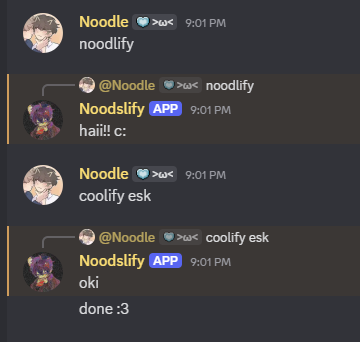

## Noodslify summon commands!!!

how it works :P

- summon commands are used in any chat (**not** slash commands)
- start with pinging @Noodslify or just typing his name in chat
- when it responds u can type the command u wanna run in chat! :D

for example:

commands u can prob use

- cutify @user - gib the cutie role
- coolify @user - gib the cool person role
- uncutify @user - remove the cutie role
- uncoolify @user - remove the cool person role

permissions

- to use `cutify` u need one of these roles: "super cool person", "super cutie", or "cutie"
- to use `coolify` u need one of these roles: "super cool person", "super cutie", "cutie", or "cool person"
- `uncoolify` can be used by super cutie+
- `uncutify` can be used by super cutie+

sum things:

- dont abuse it plz
- u can ping the user u want to perform an action to or just type out their nickname/username.

thanky for readin :3
